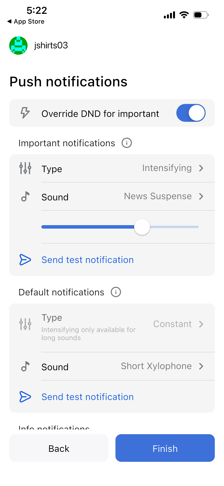
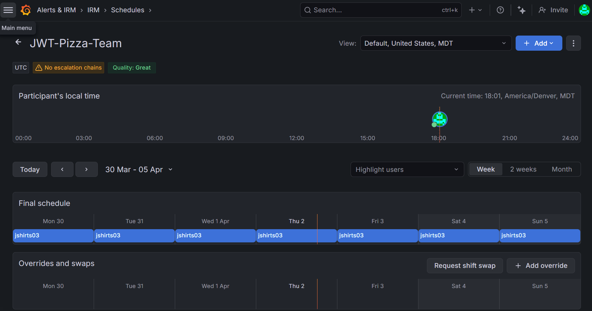
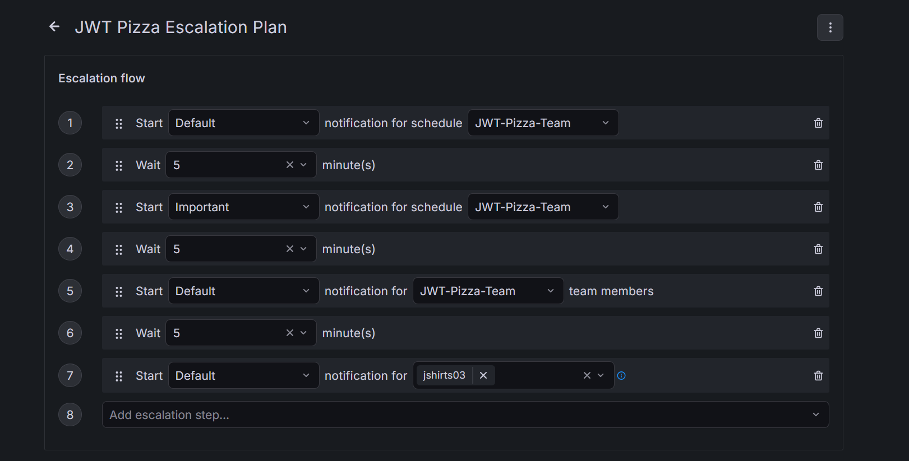
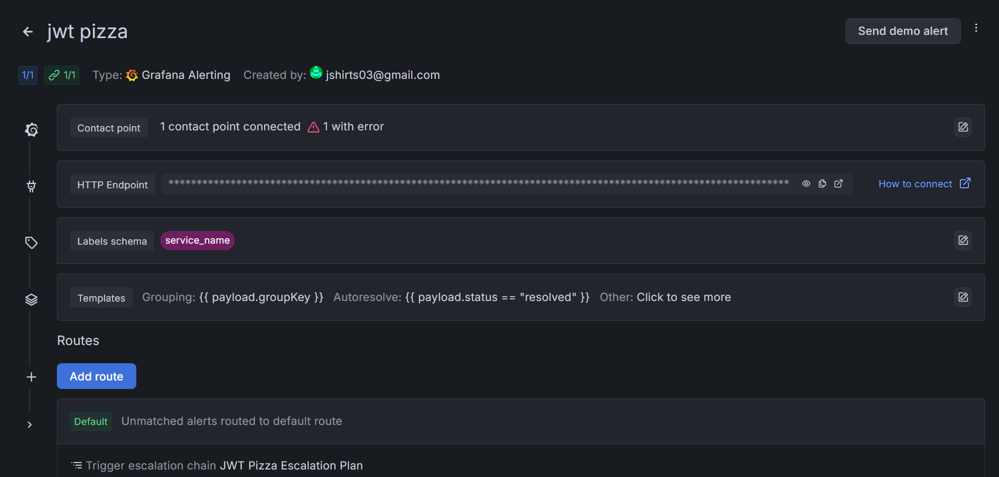
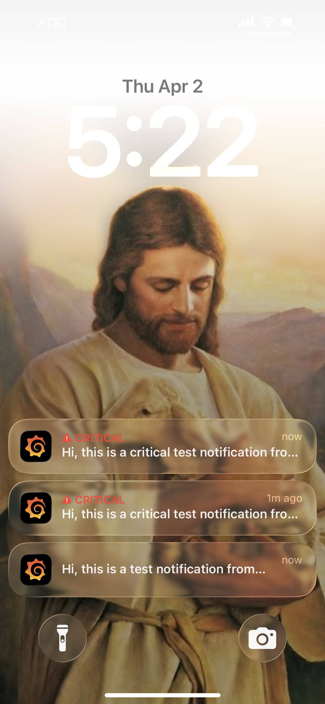

**Curiosity Report: Grafana On Call**

Context: 
When I went on the tech trek to visit Qualtrics, I met a guy named Jonathan who was a super smart software engineer. At the end of the meeting and tour of the Qualtrics office, I asked him, "What is your advice about working with a team in software engineering?" He said that in his opinion, the larger the team is, the better, because it means that you're not on call as often if you're on a large team. 

On call? Yeah, every now and then I have to be on call, and I'll get called at 1am or something and have to fix something in our system. So you're like an on-duty nurse for your production code? Yep! 

This intrigued me, and I have wondered about this concept ever since. Are software engineers really like on-call nurses? Do they really get woken up in the middle of the night to fix bugs? How does that work? 

Hence, when we learned about Grafana Oncall, I realized it was real! And not only that, I could set it up so that Grafana would call me if I had any major alerts! Professor Jenson left some light instructions about how to set up a full system and said in class it would be a great curiosity report.

1) *Configure Contact Information*
 First, I edited my user profile on Grafana to contain my phone number as contact info. I also downloaded the Grafana app.
 The app was super cool, I set up the notification noises that I wanted for a small default push and an important push. When a push is important, it will sound off even if my phone is on silent. I went with the intense news sound to signal that it means business. I can't wait to hear this during chaos testing

 

2) *Set up a Schedule*
This is exactly what my buddy was talking about. After creating my own Grafana team, I was able to set up an "on call" schedule for the team. As the current team leader and only member, I am listed as on call 24/7, but I can easily see how to edit the shifts to create a nice rotation among all team members. The Grafana app also has a setting where it will ping you 15 minutes before your shift starts so you are notified when you are on duty.

3) *Escalation Plan*
The escalation plan is a plan of action of how and when to notify team members when there is a problem. This is pretty simple since there's only 1 team member on my team, but this can be really useful to slowly get more people involved as the problem continues to go unaddressed. Initally, the person on duty will get a minor default push. After some time it will give an urgent push to the person on duty, next it will notify everyone on duty, and finally it will call me directly. This is super neat.

4) *Integration*
This was the last little step where you connect your alerts with your escalation plan. Now whenever Grafana sends out an alerts it will follow the procedures listed in my escalation plan. I'm super excited to see it in action during chaos testing, so I can catch that error or problem right away!

5) *Test Run*
I ran a test alert and it alerted my phone properly! 30 minutes after the urgent message was sent, I got a text message from Grafana. The escalation plan works properly! :)

Overall, this was a really cool curiosity project. I learned a lot about alerting and it connected a concept I learned from someone in industry to an actual automated system that I can use in JWT pizza. Pretty neat.

